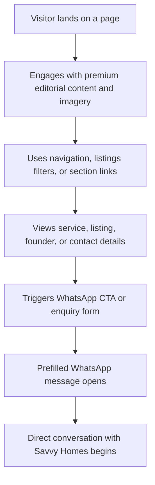

## 1. Product Overview
Savvy Homes is a 5-page static marketing website for a Nigerian real estate brand led by a strong personal founder presence. It presents premium listings, trust-building brand storytelling, and friction-light WhatsApp conversion for buyers and investors in Lagos and Abuja.

- The product helps prospects discover listings, understand services, trust the brand, and contact Chiamaka quickly through WhatsApp.
- The product value is a memorable, mobile-first, premium property experience that feels warm, cinematic, and personal rather than like a generic brokerage template.

## 2. Core Features

### 2.1 Feature Module
1. **Home**: sticky navigation, mobile overlay menu, cinematic hero, trust strip, services preview, stats, featured listings, founder anchor, testimonials, closing CTA.
2. **Listings**: page intro, filter controls, JSON-driven listing grid, WhatsApp inquiry actions, fast inquiry and shortlist request flows.
3. **About**: brand story hero, founder narrative, trust reasons, proof metrics, closing CTA.
4. **Services**: service storytelling intro, property sales, land sales, consultation, inspection, final CTA.
5. **Contact**: WhatsApp-first enquiry form, direct contact block, coverage regions.

### 2.2 Page Details
| Page Name | Module Name | Feature description |
|-----------|-------------|---------------------|
| Home | Navigation | Sticky responsive nav with body-scroll-lock mobile overlay and persistent WhatsApp CTA |
| Home | Hero | Split image-led hero with refined typography rhythm, layered depth, and conversion CTAs |
| Home | Trust Strip | Orange-led ticker that cycles through services, locations, and trust cues |
| Home | Featured Listings | Curated JSON-driven property cards with image, type, location, price, and WhatsApp CTA |
| Home | Founder Anchor | Chiamaka-led trust section that reinforces personal guidance |
| Home | Testimonials | Story-driven carousel with restrained motion and touch-friendly controls |
| Listings | Filter Bar | Client-side city and property-type filters with accessible button states |
| Listings | Listings Grid | Dynamic rendering from local JSON with friendly empty state and lazy-loaded imagery |
| Listings | Inquiry Panel | Fast Inquiry and Request a Shortlist forms that generate prefilled WhatsApp messages |
| About | Founder Narrative | Editorial biography, brand philosophy, and recurring trust framing |
| Services | Service Storytelling | Image-led sections that present services as an aspirational guided experience |
| Contact | Enquiry Form | Validated form that opens WhatsApp with a prefilled message |
| Contact | Contact Details | Direct phone, Instagram, location coverage, and WhatsApp fallback |

## 3. Core Process
Visitors arrive on a page, understand the brand quickly through images and copy, browse relevant sections or listings, and move into a direct WhatsApp conversation with minimal friction. The site supports both exploratory browsing and fast lead capture, with the founder presence acting as a recurring trust anchor.

## 4. User Interface Design
### 4.1 Design Style
- Primary colors: `#F5920A`, `#D97B00`, `#0A0A0A`, `#F7F3EE`, `#1A1A1A`
- Button style: premium rounded rectangles with strong focus rings, orange-forward primaries, and softer ghost variants
- Font system: elegant editorial serif for display headings and refined sans-serif for body text
- Layout style: mobile-first, spacious, image-led, editorial sections with restrained use of cards
- Visual details: subtle gradients, soft overlays, layered depth, controlled hover feedback, and refined motion timing

### 4.2 Page Design Overview
| Page Name | Module Name | UI Elements |
|-----------|-------------|-------------|
| Home | Hero | Editorial serif heading, layered image composition, warm neutral canvas, orange CTAs, subtle reveal motion |
| Home | Trust Strip | Full-width orange band, lightweight ticker movement, compact uppercase trust cues |
| Listings | Filter Bar | Accessible pill buttons, active orange state, low-clutter interaction model |
| Listings | Cards | Strong property imagery, clean metadata stack, WhatsApp CTA, hover lift |
| About | Founder Story | Portrait-led storytelling, elegant spacing, narrative typography, signature trust copy |
| Services | Experience Sections | Alternating image-text composition, subtle dividers, experiential copy, CTA anchors |
| Contact | Form | Simple stacked fields, visible labels, clean validation states, WhatsApp-led submit action |

### 4.3 Responsiveness
- Mobile-first from `320px` upward with no horizontal overflow
- Compact sticky mobile header with overlay menu, body scroll lock, and smooth close behavior
- Section stacks by default, then expands into balanced split layouts and grids at larger breakpoints
- Motion and layered treatments remain restrained and lightweight on small screens
