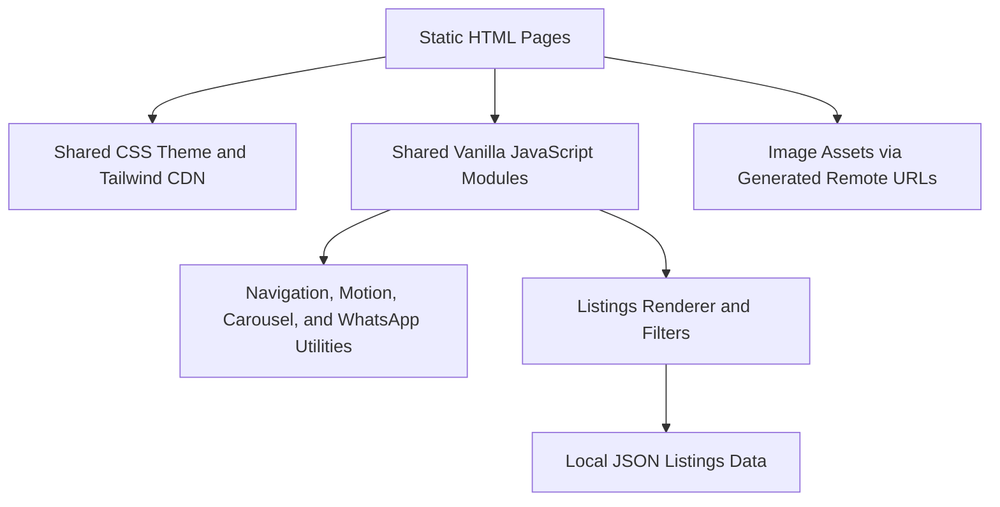

## 1. Architecture Design


## 2. Technology Description
- Frontend: static HTML5 + Tailwind CSS via CDN + custom CSS tokens
- JavaScript: vanilla ES modules
- Data: local JSON file for property listings
- Testing: Node.js built-in test runner for HTML structure and JS behavior checks
- Verification: local static server plus browser-based responsive testing

## 3. Route Definitions
| Route | Purpose |
|-------|---------|
| `/` | Home page with hero, trust sections, featured listings, founder anchor, testimonials, and CTA |
| `/listings.html` | Dynamic listings page with filters, listing cards, and inquiry flows |
| `/about.html` | Founder-led brand story and trust-building page |
| `/services.html` | Experiential services overview and guided CTA page |
| `/contact.html` | WhatsApp-first contact page with enquiry form and direct details |

## 4. Data Definitions
### 4.1 Listing Data Type
```ts
type Listing = {
  id: string
  title: string
  location: string
  city: 'Lagos' | 'Abuja'
  type: 'House' | 'Apartment' | 'Land' | 'Shortlet'
  price: string
  image: string
  alt: string
  featured: boolean
}
```

### 4.2 Client-Side Interaction Model
- `main.js`: mobile menu state, scroll locking, active navigation state, reveal observer, ticker safety helpers, testimonial carousel, shared WhatsApp utilities
- `listings.js`: fetch listings JSON, render cards, apply filters, build property-specific WhatsApp links, manage fast inquiry and shortlist flows
- Static forms never send to a backend; they construct encoded WhatsApp messages and open WhatsApp directly

## 5. File Structure
| Path | Purpose |
|------|---------|
| `index.html` | Home page |
| `listings.html` | Listings page |
| `about.html` | About page |
| `services.html` | Services page |
| `contact.html` | Contact page |
| `assets/css/styles.css` | Shared theme tokens, layout, motion, and component styling beyond Tailwind utilities |
| `assets/js/main.js` | Shared navigation, motion, carousel, ticker, and WhatsApp logic |
| `assets/js/listings.js` | Dynamic listings rendering and forms logic |
| `assets/data/listings.json` | Property listings data |
| `tests/site.test.mjs` | Site structure and behavior tests |

## 6. Implementation Notes
- Build mobile-first from the start rather than adapting desktop layouts later
- Prevent horizontal overflow across `320px`, `375px`, `414px`, and `768px`
- Keep image composition, typography rhythm, and spacing as part of the shared system instead of page-specific hacks
- Use `prefers-reduced-motion` to simplify or disable non-essential animations
- Keep the mobile navigation overlay opaque, high z-index, fully closable, and scroll-lock safe
- Favor small reusable sections and helpers over page-specific scripts
